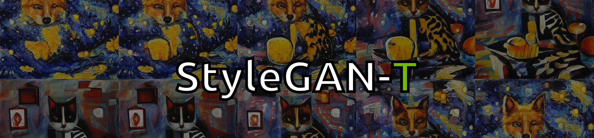

#### [[Project]](https://sites.google.com/view/stylegan-t/)    [[PDF]](https://arxiv.org/abs/2301.09515)    [[Video]](https://www.youtube.com/watch?v=MMj8OTOUIok) 
This repository contains the **training code** for our paper "StyleGAN-T: Unlocking the Power of GANs for Fast Large-Scale Text-to-Image Synthesis". **We do not provide pretrained checkpoints.**

by [Axel Sauer](https://axelsauer.com/), [Tero Karras](https://research.nvidia.com/person/tero-karras), [Samuli Laine](https://research.nvidia.com/person/samuli-laine), [Andreas Geiger](https://www.cvlibs.net/), [Timo Aila](https://research.nvidia.com/person/timo-aila)

## Requirements ##
- Use the following commands with Miniconda3 to create and activate your environment:
  ```
  conda create --name sgt python=3.9
  conda activate sgt
  conda install pytorch=1.9.1 torchvision==0.10.1 pytorch-cuda=11.6 -c pytorch -c nvidia
  pip install -r requirements.txt
  ```
- GCC 7 or later compilers. The recommended GCC version depends on your CUDA version; see for example, CUDA 11.4 system requirements.
- If you run into problems when setting up the custom CUDA kernels, we refer to the [Troubleshooting docs](https://github.com/NVlabs/stylegan3/blob/main/docs/troubleshooting.md#why-is-cuda-toolkit-installation-necessary) of the StyleGAN3 repo.


## Data Preparation ##

StyleGAN-T can be trained on unconditional and conditional datasets. For small-scale experiments, we recommend zip datasets. When training on datasets with more than 1 million images, we recommend using webdatasets.

### Zip Dataset
Zip-Datasets are stored in the same format as in the previous iterations of [StyleGAN](https://github.com/NVlabs/stylegan3): uncompressed ZIP archives containing uncompressed PNG files and a metadata file `dataset.json` for labels. Custom datasets can be created from a folder containing images.


**CIFAR-10:** Download the [CIFAR-10 python version](https://www.cs.toronto.edu/~kriz/cifar.html) and convert to ZIP archive:

```.bash
python dataset_tool.py --source downloads/cifar10/cifar-10-python.tar.gz \
    --dest data/cifar10-32x32.zip
```

**FFHQ:** Download the [Flickr-Faces-HQ dataset](https://github.com/NVlabs/ffhq-dataset) as 1024x1024 images and convert to ZIP archive at the same resolution:

```.bash
python dataset_tool.py --source downloads/ffhq/images1024x1024 \
    --dest data/ffhq1024.zip --resolution 1024x1024
```

**COCO validation set:** The COCO validation set is used for tracking zero-shot FID and CLIP score. First, download the [COCO meta data](https://drive.google.com/file/d/1Xbg36mTJGG68RI_YgSPwhAE2msxgGfaC/view?usp=sharing). Then, run
```.bash
python dataset_tool.py --source downloads/captions_val2014.json \
  --dest data/coco_val256.zip --resolution 256x256 --transform center-crop
```

It is recommend to prepare the dataset zip at the highest possible resolution, e.g. for FFHQ, the zip should contain images with 1024x1024 pixels. When training lower-resolution models, the training script can downsample the images on the fly. 

### WebDataset
For preparing webdatasets, we used the excellent [img2dataset](https://github.com/rom1504/img2dataset) tool. Documentation for downloading different datasets can be found [here](https://github.com/rom1504/img2dataset/tree/main/dataset_examples). For our experiments, we used data from the following sources: [CC3M](https://ai.google.com/research/ConceptualCaptions/download), [CC12M](https://github.com/google-research-datasets/conceptual-12m), [YFFC100m](https://huggingface.co/datasets/dalle-mini/YFCC100M_OpenAI_subset), [Redcaps](https://huggingface.co/datasets/red_caps), [LAION-aesthetic-6plus](https://huggingface.co/datasets/ChristophSchuhmann/improved_aesthetics_6plus).

The joint dataset should have the following structure
```joint_dataset/
joint_dataset/cc3m/0000.tar
joint_dataset/cc3m/0001.tar
...
joint_dataset/laion_6plus/0000.tar
joint_dataset/laion_6plus/0001.tar
...
```
## Training ##

Training StyleGAN-T with full capacity on MYDATASET.zip at a resolution of 64x64 pixels:

```
python -m torch.distributed.run --standalone --nproc_per_node 1 train.py \
  --outdir ./training-runs/ --cfg full --data ./data/MYDATASET.zip \
  --img-resolution 64 --batch 128 --batch-gpu 8 --kimg 25000 --metrics fid50k_full
```

- The above commands can be parallelized across multiple GPUs by adjusting ```--nproc_per_node```.
- ```--batch``` specifies the overall batch size, ```--batch-gpu``` specifies the batch size per GPU. Be aware that ```--batch-gpu``` is also a hyperparameter as the discriminator uses (local) BatchNorm; We generally recommend ```--batch-gpu``` of 4 or 8.
The training loop will automatically accumulate gradients if you use fewer GPUs until the overall batch size is reached. 
- Samples and metrics are saved in ```outdir```. You can inspect ```METRIC_NAME.json``` or run tensorboard in ```training-runs/``` to monitor the training progress.
- The generator will be conditional if the dataset contains text labels; otherwise, it will be unconditional.
- For a webdataset comprised of different subsets, the data path should point to the joint parent directory: ```--data path/to/joint_dataset/```

To use the same configuration we used for our ablation study, use ```--cfg lite```. If you want direct control over network parameters, use a custom config. E.g., a smaller models which has 1 residual block, a capacity multiplier of 16384 and a maximum channel count of 256, run

```
python -m torch.distributed.run --standalone --nproc_per_node 1 train.py \
  --outdir ./training-runs/ --data ./data/MYDATASET.zip \
  --img-resolution 64 --batch 128 --batch-gpu 8 --kimg 25000 --metrics fid50k_full \
  --cfg custom --cbase 16384 --cmax 256 --res-blocks 1
```

For a description of all input arguments, run ```python train.py --help```

###  Starting from pretrained checkpoints

If you want to use a previously trained model, you can start from a checkpoint by specifying its path adding ```--resume PATH_TO_NETWORK_PKL```. If you want to continue training from where you left off in a previous run, you can also specify the number of images processed in that run using ```--resume-kimg XXX```, where XXX is that number.

### Training modes

By default, all layers of the generator are trained and the CLIP text encoder is frozen. If you want to train only the text encoder, provide ```--train-mode text-encoder```. 

If you want to do progressive growing, first train a model at 64x64 pixels. Then provide the path to this pretrained network via ```-resume```, the new target resolution via ```--img-resolution```  and use ```--train-mode freeze64``` to freeze the blocks of the 64x64 model and only train the high resolution layers. For example:

```
python -m torch.distributed.run --standalone --nproc_per_node 1 train.py \
  --outdir ./training-runs/ --data ./data/MYDATASET.zip \
  --img-resolution 512 --batch 128 --batch-gpu 4 --kimg 25000 \
  --cfg lite --resume PATH_TO_NETWORK_64 --train-mode freeze64
```

## Generating Samples ##
To generate samples with a given network, run
```
python gen_images.py --network PATH_TO_NETWORK_PKL \
 --prompt 'A painting of a fox in the style of starry night.' \
 --truncation 1 --outdir out --seeds 0-29
```

For a description of all input arguments, run ```python gen_images.py --help```

## Quality Metrics ##
To calculate metrics for a specific network snapshot, run

```
python calc_metrics.py --metrics METRIC_NAME --network PATH_TO_NETWORK_PKL
```

Metric computation is only supported on zip datasets, not webdatasets. The zero-shot COCO metrics expect a ```coco_val256.zip``` to be present in the same folder as the training dataset. Alternatively, one can explicitely set an environment variable as follows: ```export COCOPATH=path/to/coco_val256.zip```.

To see the available metrics, run ```python calc_metrics.py --help```


## License ##

Copyright &copy; 2023, NVIDIA Corporation. All rights reserved.

This work is made available under the [Nvidia Source Code License](https://nvlabs.github.io/stylegan2-ada-pytorch/license.html).

Excempt are the files ```training/diffaug.py``` and ```networks/vit_utils.py``` which are partially or fully based on third party github repositories. These two files are copyright their respective authors and under their respective licenses; we include the original license and link to the source at the beginning of the files.

## Development ##

This is a research reference implementation and is treated as a one-time code drop. As such, we do not accept outside code contributions in the form of pull requests.

## Citation ##

```bibtex
@InProceedings{Sauer2023ARXIV,
  author    = {Axel Sauer and Tero Karras and Samuli Laine and Andreas Geiger and Timo Aila},
  title     = {{StyleGAN-T}: Unlocking the Power of {GANs} for Fast Large-Scale Text-to-Image Synthesis},
  journal   = {{arXiv.org}},
  volume    = {abs/2301.09515},
  year      = {2023},
  url       = {https://arxiv.org/abs/2301.09515},
}
```
